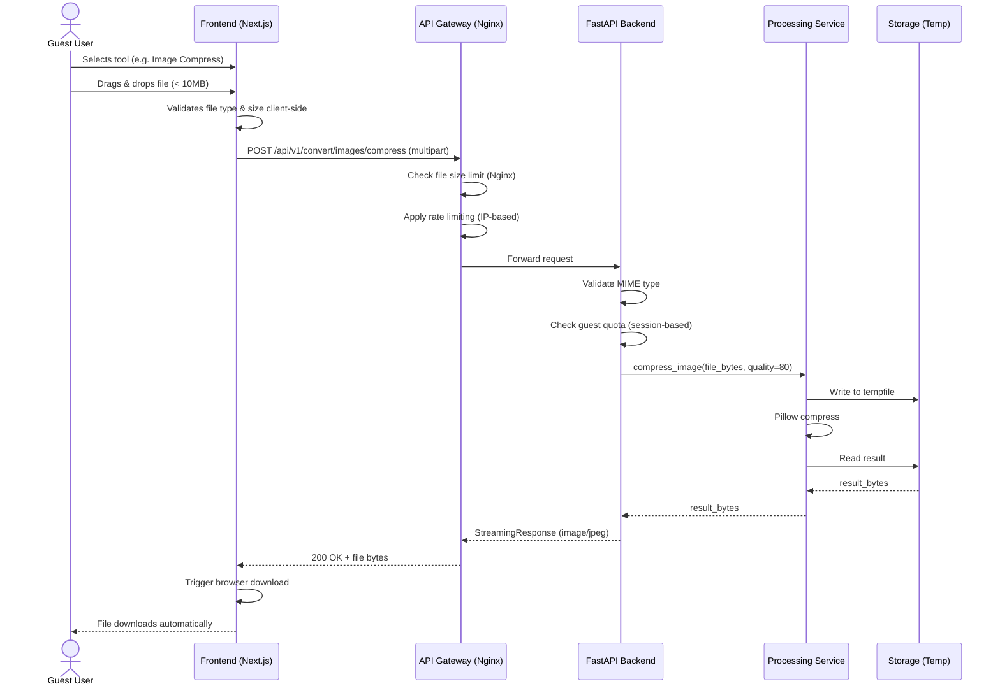
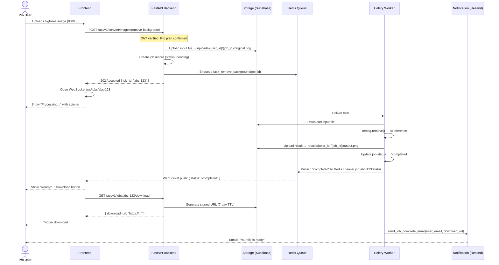
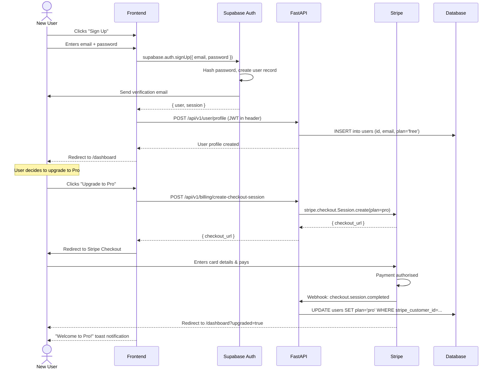
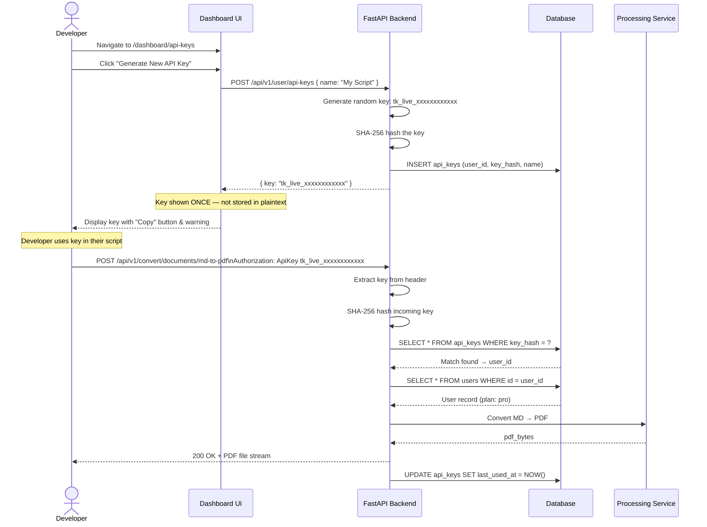
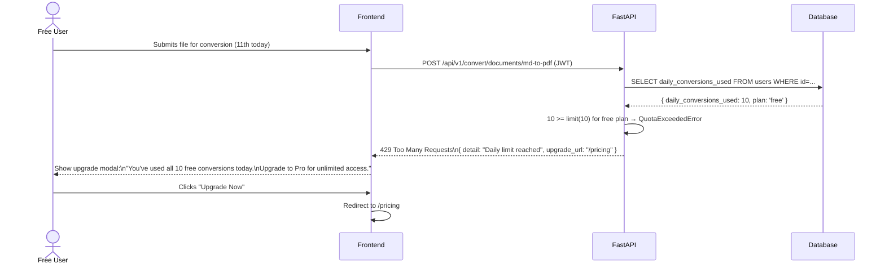

# ToolKit — System Layers, Sequence Diagrams & User Stories

> **Document Type:** System Design Reference
> **Version:** 0.1
> **Scope:** Public-facing SaaS platform (Zamzar-style) — full system layer analysis, interaction flows, and user story definitions
> **Audience:** Engineering team, product stakeholders, system architects

---

## Table of Contents

1. [Platform Vision Recap](#1-platform-vision-recap)
2. [System Layer Overview](#2-system-layer-overview)
3. [Layer 1 — Presentation Layer](#3-layer-1--presentation-layer)
4. [Layer 2 — API Gateway Layer](#4-layer-2--api-gateway-layer)
5. [Layer 3 — Authentication & Identity Layer](#5-layer-3--authentication--identity-layer)
6. [Layer 4 — Business Logic & Processing Layer](#6-layer-4--business-logic--processing-layer)
7. [Layer 5 — Task Queue & Worker Layer](#7-layer-5--task-queue--worker-layer)
8. [Layer 6 — Storage Layer](#8-layer-6--storage-layer)
9. [Layer 7 — Notification Layer](#9-layer-7--notification-layer)
10. [Layer 8 — Billing & Subscription Layer](#10-layer-8--billing--subscription-layer)
11. [Layer 9 — Infrastructure & Observability Layer](#11-layer-9--infrastructure--observability-layer)
12. [Sequence Diagrams](#12-sequence-diagrams)
13. [User Stories](#13-user-stories)
14. [Cross-Layer Data Flow Summary](#14-cross-layer-data-flow-summary)

---

## 1. Platform Vision Recap

ToolKit is a **public-facing, SaaS file conversion and processing platform** inspired by Zamzar. Any user — authenticated or guest — can visit the platform, upload a file (document, image, or data file), select a processing operation, and download or receive the result.

The platform operates on a **freemium model**:
- **Guest / Free users**: Limited conversions per day, capped file size, basic tool access
- **Pro users**: Unlimited conversions, larger file sizes, priority processing, email delivery
- **Team users**: Shared workspaces, API access, bulk processing, higher rate limits

Unlike Zamzar, ToolKit also exposes a **developer API** so users can integrate file processing directly into their own pipelines without using the web UI.

---

## 2. System Layer Overview

ToolKit is composed of **9 distinct architectural layers**, each with a clearly defined responsibility. Layers communicate through well-defined interfaces — HTTP, message queues, or storage references — ensuring that each layer can be scaled, replaced, or maintained independently.

```
┌──────────────────────────────────────────────────────────────────────┐
│  LAYER 1 — Presentation Layer           (Next.js 14 / React)         │
├──────────────────────────────────────────────────────────────────────┤
│  LAYER 2 — API Gateway Layer            (Nginx + FastAPI Router)      │
├──────────────────────────────────────────────────────────────────────┤
│  LAYER 3 — Authentication & Identity    (Supabase Auth / JWT)         │
├──────────────────────────────────────────────────────────────────────┤
│  LAYER 4 — Business Logic & Processing  (FastAPI Services)            │
├──────────────────────────────────────────────────────────────────────┤
│  LAYER 5 — Task Queue & Workers         (Celery + Redis)              │
├──────────────────────────────────────────────────────────────────────┤
│  LAYER 6 — Storage Layer                (Supabase Storage / S3)       │
├──────────────────────────────────────────────────────────────────────┤
│  LAYER 7 — Notification Layer           (Resend / SMTP + WebSocket)   │
├──────────────────────────────────────────────────────────────────────┤
│  LAYER 8 — Billing & Subscription       (Stripe)                      │
├──────────────────────────────────────────────────────────────────────┤
│  LAYER 9 — Infrastructure & Observability (Docker, Sentry, Prometheus)│
└──────────────────────────────────────────────────────────────────────┘
```

Each layer is described in full detail in the sections below.

---

## 3. Layer 1 — Presentation Layer

### Responsibility
The Presentation Layer is everything the end user sees and interacts with. It is responsible for rendering the UI, handling user input, managing client-side state, communicating with the API Gateway, and delivering a polished experience across all devices.

### Technology
| Component | Technology | Purpose |
|---|---|---|
| Framework | Next.js 14 (App Router) | Page routing, SSR, metadata |
| Language | TypeScript | Type-safe component logic |
| Styling | Tailwind CSS | Utility-first design system |
| UI Components | shadcn/ui | Accessible, composable UI primitives |
| Animation | Framer Motion | Page transitions, micro-animations |
| Icons | Lucide React | Consistent iconography |
| HTTP Client | Axios | API communication |
| Auth Client | Supabase JS SDK | Session management in the browser |
| Payments Client | Stripe.js | Secure payment form rendering |

### Pages & Routes

| Route | Description |
|---|---|
| `/` | Public landing page — hero, features, pricing |
| `/tools` | Tool discovery grid — all available tools |
| `/tools/[category]/[tool]` | Individual tool page (e.g. `/tools/documents/md-to-pdf`) |
| `/dashboard` | Authenticated user dashboard — history, usage stats |
| `/dashboard/history` | Full conversion history with download links |
| `/dashboard/api-keys` | Manage API keys for programmatic access |
| `/pricing` | Pricing plans and feature comparison |
| `/auth/login` | Login page |
| `/auth/register` | Registration page |
| `/auth/callback` | OAuth redirect handler |
| `/account` | Account settings, plan management |

### Client Responsibilities

1. **File Upload**: Accept files via drag-and-drop or file picker. Validate file type and size client-side before uploading to reduce unnecessary API calls.
2. **Progress Feedback**: Show upload progress, processing status polling (or WebSocket updates), and download readiness.
3. **Result Delivery**: Trigger browser download of the processed file or display a shareable link.
4. **Session Handling**: Read JWT from Supabase session, attach `Authorization: Bearer <token>` header to all authenticated API calls.
5. **Usage Metering Display**: Show the user their remaining free conversions and prompt upgrade when limit is approached.

### Client-Side Validation Rules (pre-API)

| Check | Free User | Pro User |
|---|---|---|
| Max file size | 25 MB | 500 MB |
| Allowed MIME types | Per tool, validated from config | Same |
| Daily conversion count | 10 | Unlimited |
| Concurrent uploads | 1 | 5 |

---

## 4. Layer 2 — API Gateway Layer

### Responsibility
The API Gateway is the single entry point for all HTTP traffic from the frontend and external API consumers. It handles routing, rate limiting, request authentication pre-checks, file size enforcement, CORS, and load distribution. No business logic lives in this layer.

### Technology
| Component | Technology |
|---|---|
| Reverse Proxy | Nginx |
| Application Router | FastAPI (Router-level) |
| Rate Limiting | `slowapi` (FastAPI middleware) + Nginx `limit_req` |
| SSL Termination | Nginx (Let's Encrypt / Certbot) |
| CORS | FastAPI `CORSMiddleware` |

### Nginx Responsibilities

```nginx
# nginx.conf (excerpt)
server {
    listen 443 ssl;
    server_name toolkit.app;

    # SSL
    ssl_certificate /etc/letsencrypt/live/toolkit.app/fullchain.pem;
    ssl_certificate_key /etc/letsencrypt/live/toolkit.app/privkey.pem;

    # File upload size limit (hard cap — never reaches Python)
    client_max_body_size 500M;

    # Rate limit zone: 30 requests per minute per IP
    limit_req zone=api_limit burst=10 nodelay;

    # Route API traffic to FastAPI
    location /api/ {
        proxy_pass http://backend:8000;
        proxy_set_header X-Real-IP $remote_addr;
        proxy_set_header X-Forwarded-For $proxy_add_x_forwarded_for;
    }

    # Route everything else to Next.js
    location / {
        proxy_pass http://frontend:3000;
    }
}
```

### FastAPI Router Structure

```
/api/v1/
├── /auth/            → Authentication endpoints (login, register, refresh)
├── /user/            → User profile, usage stats, API keys
├── /convert/         → File conversion job submission
│   ├── /documents/   → Document conversions
│   ├── /images/      → Image processing
│   └── /utilities/   → Developer utilities
├── /jobs/            → Job status polling
│   ├── /{job_id}     → GET job status
│   └── /{job_id}/download → GET processed file
├── /billing/         → Stripe webhooks, plan info
└── /webhooks/        → External webhook receivers
```

### Request Lifecycle at Gateway

1. Request arrives at Nginx
2. Nginx checks `client_max_body_size` — rejects oversized requests with `413`
3. Nginx applies rate limiting — rejects with `429` if exceeded
4. Nginx proxies to FastAPI
5. FastAPI `CORSMiddleware` validates `Origin` header
6. FastAPI `AuthMiddleware` reads and validates JWT (if present)
7. FastAPI `UsageMiddleware` checks conversion quota for authenticated users
8. Request is routed to appropriate router and handler

---

## 5. Layer 3 — Authentication & Identity Layer

### Responsibility
This layer manages who users are, verifies their identity, issues access tokens, manages sessions, and controls what each user is permitted to do (authorization). It also manages user tiers (Guest, Free, Pro, Team) which gate access to features throughout the system.

### Technology
| Component | Technology | Reason |
|---|---|---|
| Auth Provider | Supabase Auth | Managed, supports OAuth + email/password |
| Token Standard | JWT (RS256) | Stateless, verifiable without DB round-trip |
| Social OAuth | Google, GitHub (via Supabase) | Reduces friction for developer users |
| Password Hashing | bcrypt via passlib | Industry standard |
| API Key Auth | Custom — SHA-256 hashed keys in DB | For programmatic API access |

### User Tiers & Permissions

| Permission | Guest | Free | Pro | Team |
|---|---|---|---|---|
| Daily conversions | 3 | 10 | Unlimited | Unlimited |
| Max file size | 10 MB | 25 MB | 500 MB | 2 GB |
| Conversion history | ❌ | 7 days | 90 days | 1 year |
| Email delivery | ❌ | ❌ | ✅ | ✅ |
| API access | ❌ | ❌ | ✅ | ✅ |
| Shareable links | ❌ | ✅ | ✅ | ✅ |
| Bulk processing | ❌ | ❌ | ✅ | ✅ |
| Team workspace | ❌ | ❌ | ❌ | ✅ |

### JWT Structure

```json
{
  "sub": "user-uuid-here",
  "email": "user@example.com",
  "role": "pro",
  "plan_expires_at": "2027-01-01T00:00:00Z",
  "iat": 1753000000,
  "exp": 1753003600
}
```

### FastAPI Auth Dependency

```python
from fastapi import Depends, HTTPException, Security
from fastapi.security import HTTPBearer

security = HTTPBearer(auto_error=False)

async def get_current_user(token = Security(security)) -> User | None:
    if token is None:
        return None  # Guest access
    try:
        payload = jwt.decode(token.credentials, PUBLIC_KEY, algorithms=["RS256"])
        return await UserService.get_by_id(payload["sub"])
    except JWTError:
        raise HTTPException(status_code=401, detail="Invalid or expired token")

async def require_pro(user: User = Depends(get_current_user)):
    if not user or user.plan not in ("pro", "team"):
        raise HTTPException(status_code=403, detail="Pro plan required")
```

---

## 6. Layer 4 — Business Logic & Processing Layer

### Responsibility
This is the core of the platform. It receives validated, authenticated requests and orchestrates file processing using the appropriate Python libraries. For lightweight jobs (< 5 seconds), processing happens **synchronously** within the FastAPI request. For heavy jobs, processing is **delegated to the Task Queue Layer (Layer 5)** and the client receives a `job_id` to poll for status.

### Synchronous vs Asynchronous Processing Decision

| Condition | Strategy | Example |
|---|---|---|
| Estimated time < 5s AND file < 10MB | Synchronous — return file directly | JSON format, small image compress |
| Estimated time > 5s OR file > 10MB | Async — return `job_id`, process in background | PDF conversion, background removal |
| Pro user explicitly requests email delivery | Always async | Large DOCX → PDF |

### Processing Services

#### Document Service (`services/documents.py`)
Handles all document conversion operations.

| Operation | Library Used | Sync/Async |
|---|---|---|
| MD → PDF | pypandoc + weasyprint | Async |
| MD → DOCX | pypandoc + python-docx | Sync |
| DOCX → Markdown | pypandoc | Sync |
| HTML → PDF | weasyprint | Async |
| LaTeX → PDF | pypandoc (pdflatex engine) | Async |
| PDF Merge | pypdf | Sync (< 20MB total) / Async |
| PDF Split | pypdf | Sync |
| PDF → Text | pypdf | Sync |
| PDF Watermark | pypdf | Async |

#### Image Service (`services/images.py`)
Handles all image processing operations.

| Operation | Library Used | Sync/Async |
|---|---|---|
| Background Removal | rembg | Async (always — AI inference) |
| Compress | Pillow | Sync |
| Format Convert | Pillow | Sync |
| Resize | Pillow | Sync |
| SVG → PNG/PDF | cairosvg | Sync |
| Grayscale | Pillow | Sync |
| Crop | Pillow | Sync |
| Deskew / Straighten | OpenCV | Async |

#### Utilities Service (`services/utilities.py`)
All utility operations are synchronous and return JSON responses (not files).

| Operation | Library | Returns |
|---|---|---|
| JSON Format/Validate | Built-in `json` | Formatted JSON string |
| CSV ↔ JSON | Built-in `csv` + `json` | Converted data |
| Base64 Encode/Decode | Built-in `base64` | Encoded/decoded string |
| Hash Generate | `hashlib` | Hash string |
| JWT Decode | `python-jose` | Decoded claims JSON |
| Diff Check | `difflib` | HTML diff string |
| QR Code | `qrcode` | PNG image bytes |
| Password Generate | `secrets` | Password string |
| Color Convert | Custom logic | Converted color values |
| Timestamp Convert | Built-in `datetime` | Formatted datetime string |

### Error Handling Strategy

All services raise typed exceptions that map to HTTP responses:

```python
class FileTooLargeError(ToolKitException):
    status_code = 413

class UnsupportedFormatError(ToolKitException):
    status_code = 415

class ConversionFailedError(ToolKitException):
    status_code = 422

class QuotaExceededError(ToolKitException):
    status_code = 429
```

---

## 7. Layer 5 — Task Queue & Worker Layer

### Responsibility
Offloads long-running or resource-intensive processing jobs from the FastAPI request cycle onto dedicated background workers. Ensures the API remains responsive even when handling 4K image background removal or a 100-page PDF conversion. Provides job status tracking and result persistence.

### Technology
| Component | Technology |
|---|---|
| Task Queue | Celery 5.x |
| Message Broker | Redis 7 |
| Result Backend | Redis 7 (or Supabase DB for persistence) |
| Worker Scaling | Docker Compose `--scale worker=N` |

### Job Lifecycle

```
Client submits file
       │
       ▼
FastAPI validates & saves file to temp storage
       │
       ▼
Celery task enqueued → Redis broker
       │
       ▼
Worker picks up task → processes file
       │
       ├─── Success → saves result to Storage Layer
       │              → updates job status to "completed"
       │              → triggers Notification Layer (if email requested)
       │
       └─── Failure → updates job status to "failed"
                    → logs error to Sentry
```

### Job Status Model

```python
class JobStatus(str, Enum):
    PENDING   = "pending"    # Enqueued, not yet started
    PROCESSING = "processing" # Worker has picked it up
    COMPLETED  = "completed"  # Result available
    FAILED     = "failed"     # Processing error
    EXPIRED    = "expired"    # Result TTL elapsed, file deleted
```

### Celery Task Example

```python
# workers/tasks.py
from celery import shared_task
from services.images import remove_background_sync
from services.storage import upload_result
from services.jobs import update_job_status

@shared_task(bind=True, max_retries=3, default_retry_delay=5)
def task_remove_background(self, job_id: str, input_path: str, user_id: str):
    try:
        update_job_status(job_id, "processing")
        result_bytes = remove_background_sync(input_path)
        output_url = upload_result(result_bytes, job_id, "no_bg.png")
        update_job_status(job_id, "completed", output_url=output_url)
    except Exception as exc:
        update_job_status(job_id, "failed", error=str(exc))
        raise self.retry(exc=exc)
```

### Worker Scaling Strategy

- **Development**: 1 worker, 1 concurrency
- **Production (small)**: 2 workers, 4 concurrency each
- **Production (large)**: Auto-scale workers via Kubernetes HPA or Docker Swarm

### Result TTL Policy

| User Tier | Result Retention |
|---|---|
| Guest | 1 hour |
| Free | 24 hours |
| Pro | 7 days |
| Team | 30 days |

After TTL, files are automatically deleted from storage and the job status is set to `expired`.

---

## 8. Layer 6 — Storage Layer

### Responsibility
Manages the persistence of uploaded input files and processed output files. The Storage Layer is the only layer that retains data beyond a single request. It is also responsible for enforcing per-user storage quotas and file TTL expiry policies.

### Technology
| Component | Technology | Role |
|---|---|---|
| Primary Object Store | Supabase Storage (S3-compatible) | All file storage |
| Fallback / Scale | AWS S3 | If traffic exceeds Supabase free tier |
| Temp Processing | Python `tempfile` module | In-flight file handling |
| CDN | Cloudflare | Cached delivery of output files |

### Storage Buckets

| Bucket | Contents | Access | TTL |
|---|---|---|---|
| `uploads/` | Raw uploaded input files | Private (signed URLs) | 2 hours |
| `results/` | Processed output files | Private (signed URLs) | Per user tier |
| `thumbnails/` | Image preview thumbnails | Public | 24 hours |
| `qr-codes/` | Generated QR code images | Public | 7 days |

### File Path Convention

```
uploads/{user_id}/{job_id}/original.{ext}
results/{user_id}/{job_id}/output.{ext}
thumbnails/{user_id}/{job_id}/thumb.webp
```

For guest users, `user_id` is replaced by a session UUID generated client-side.

### Signed URL Flow

All file access uses **time-limited signed URLs** — never permanent public links:

```python
from supabase import create_client

supabase = create_client(SUPABASE_URL, SUPABASE_KEY)

def get_download_url(path: str, expires_in: int = 3600) -> str:
    response = supabase.storage.from_("results").create_signed_url(
        path=path,
        expires_in=expires_in
    )
    return response["signedURL"]
```

### Storage Quota Enforcement

| Tier | Max stored output | Enforcement |
|---|---|---|
| Guest | None (session only) | TTL: 1 hour |
| Free | 100 MB total | Checked before each job |
| Pro | 10 GB total | Checked before each job |
| Team | 100 GB total | Configurable per team |

---

## 9. Layer 7 — Notification Layer

### Responsibility
Keeps users informed about job status changes — either in real-time via WebSocket push notifications in the browser, or asynchronously via transactional email (e.g. "Your file is ready to download"). Also handles system notifications (subscription renewal, quota warnings).

### Technology

| Channel | Technology | Use Case |
|---|---|---|
| Email | Resend (API) | Job completion, signup, billing |
| Real-time | WebSocket (FastAPI + Redis Pub/Sub) | In-browser job status updates |
| In-app toast | shadcn/ui Toast | Instant feedback for sync operations |

### Email Notifications

Triggered when:
- A background job completes (Pro users who enabled email delivery)
- A user's free quota is at 80% and 100%
- A subscription is renewed or fails
- A password reset is requested
- A new device logs in (security alert)

```python
# services/notifications.py
import resend

resend.api_key = RESEND_API_KEY

async def send_job_complete_email(user_email: str, download_url: str, filename: str):
    await resend.Emails.send({
        "from": "ToolKit <noreply@toolkit.app>",
        "to": user_email,
        "subject": f"Your file '{filename}' is ready",
        "html": render_template("job_complete.html", {
            "download_url": download_url,
            "expires_in": "7 days",
            "filename": filename
        })
    })
```

### WebSocket Real-Time Updates

For in-browser polling-free status updates:

```python
# FastAPI WebSocket endpoint
@app.websocket("/ws/jobs/{job_id}")
async def job_status_ws(websocket: WebSocket, job_id: str):
    await websocket.accept()
    pubsub = redis.pubsub()
    await pubsub.subscribe(f"job:{job_id}:status")

    async for message in pubsub.listen():
        if message["type"] == "message":
            await websocket.send_json({"status": message["data"]})
            if message["data"] in ("completed", "failed"):
                break
    await websocket.close()
```

---

## 10. Layer 8 — Billing & Subscription Layer

### Responsibility
Manages all money-related operations: subscription plans, payment processing, invoicing, usage-based billing, and webhook event handling from Stripe. This layer ensures that only paying users access Pro/Team features and that subscription state stays in sync between Stripe and the ToolKit database.

### Technology
| Component | Technology |
|---|---|
| Payment Processor | Stripe |
| Stripe SDK | `stripe` Python library |
| Frontend Payments | Stripe.js + Stripe Elements |
| Webhook Security | Stripe webhook signature verification |

### Plans & Pricing Model

| Plan | Price | Features |
|---|---|---|
| **Free** | $0/month | 10 conversions/day, 25MB files, 24h history |
| **Pro** | $9/month | Unlimited conversions, 500MB files, 90-day history, email delivery, API access |
| **Team** | $29/month | Everything in Pro + shared workspace, 2GB files, 1-year history, 5 team members |

### Stripe Objects Mapping

| Stripe Object | ToolKit Equivalent |
|---|---|
| `Customer` | `User` record |
| `Subscription` | Active plan for a user |
| `Price` | Plan tier (Free, Pro, Team) |
| `Invoice` | Monthly billing statement |
| `PaymentIntent` | One-time payment |
| `Webhook Event` | Subscription lifecycle events |

### Webhook Events Handled

| Stripe Event | Action Taken |
|---|---|
| `checkout.session.completed` | Activate Pro/Team plan for user |
| `invoice.payment_succeeded` | Extend subscription, send receipt email |
| `invoice.payment_failed` | Send payment failure email, downgrade after 3 failures |
| `customer.subscription.deleted` | Downgrade user to Free plan |
| `customer.subscription.updated` | Sync plan changes (upgrade/downgrade) |

### Webhook Handler (FastAPI)

```python
@app.post("/api/v1/webhooks/stripe")
async def stripe_webhook(request: Request):
    payload = await request.body()
    sig_header = request.headers.get("stripe-signature")

    try:
        event = stripe.Webhook.construct_event(
            payload, sig_header, STRIPE_WEBHOOK_SECRET
        )
    except stripe.error.SignatureVerificationError:
        raise HTTPException(status_code=400, detail="Invalid signature")

    if event["type"] == "checkout.session.completed":
        session = event["data"]["object"]
        await activate_subscription(session["customer"], session["subscription"])

    elif event["type"] == "customer.subscription.deleted":
        await downgrade_to_free(event["data"]["object"]["customer"])

    return {"status": "ok"}
```

---

## 11. Layer 9 — Infrastructure & Observability Layer

### Responsibility
Provides the foundation that all other layers run on. Handles containerisation, service orchestration, environment configuration, monitoring, error tracking, logging, and database management. This layer is invisible to end users but critical to platform reliability.

### Technology

| Component | Technology | Purpose |
|---|---|---|
| Containerisation | Docker | Package each service into an image |
| Orchestration | Docker Compose (dev) / Kubernetes (prod) | Multi-service coordination |
| Database | Supabase (PostgreSQL) | Users, jobs, billing records |
| Cache | Redis 7 | Session cache, Celery broker, rate limit counters |
| Error Tracking | Sentry | Exception capture across backend and frontend |
| Metrics | Prometheus + Grafana | CPU, memory, request rate, job queue depth |
| Logging | Loki + Grafana | Centralized log aggregation |
| Secrets Management | Environment variables + Docker secrets | API keys, database URLs |
| SSL | Let's Encrypt + Certbot | Automatic HTTPS |

### Database Schema (Core Tables)

```sql
-- Users
CREATE TABLE users (
    id          UUID PRIMARY KEY DEFAULT gen_random_uuid(),
    email       TEXT UNIQUE NOT NULL,
    plan        TEXT DEFAULT 'free' CHECK (plan IN ('free','pro','team')),
    stripe_customer_id TEXT,
    daily_conversions_used INT DEFAULT 0,
    last_reset_at TIMESTAMPTZ DEFAULT NOW(),
    created_at  TIMESTAMPTZ DEFAULT NOW()
);

-- Jobs
CREATE TABLE jobs (
    id          UUID PRIMARY KEY DEFAULT gen_random_uuid(),
    user_id     UUID REFERENCES users(id),
    session_id  TEXT,           -- For guest users
    tool        TEXT NOT NULL,
    input_path  TEXT NOT NULL,
    output_path TEXT,
    status      TEXT DEFAULT 'pending',
    error       TEXT,
    created_at  TIMESTAMPTZ DEFAULT NOW(),
    completed_at TIMESTAMPTZ,
    expires_at  TIMESTAMPTZ
);

-- API Keys
CREATE TABLE api_keys (
    id          UUID PRIMARY KEY DEFAULT gen_random_uuid(),
    user_id     UUID REFERENCES users(id),
    key_hash    TEXT UNIQUE NOT NULL,  -- SHA-256 hash
    name        TEXT,
    last_used_at TIMESTAMPTZ,
    created_at  TIMESTAMPTZ DEFAULT NOW()
);
```

### Docker Compose (Production-Ready)

```yaml
version: "3.9"

services:
  nginx:
    image: nginx:alpine
    ports:
      - "80:80"
      - "443:443"
    volumes:
      - ./nginx.conf:/etc/nginx/nginx.conf
      - ./certs:/etc/letsencrypt
    depends_on:
      - backend
      - frontend

  frontend:
    build: ./frontend
    environment:
      - NEXT_PUBLIC_API_URL=https://toolkit.app/api
      - NEXT_PUBLIC_SUPABASE_URL=${SUPABASE_URL}
      - NEXT_PUBLIC_SUPABASE_ANON_KEY=${SUPABASE_ANON_KEY}

  backend:
    build: ./backend
    environment:
      - DATABASE_URL=${DATABASE_URL}
      - REDIS_URL=redis://redis:6379/0
      - SUPABASE_URL=${SUPABASE_URL}
      - SUPABASE_SERVICE_KEY=${SUPABASE_SERVICE_KEY}
      - STRIPE_SECRET_KEY=${STRIPE_SECRET_KEY}
      - STRIPE_WEBHOOK_SECRET=${STRIPE_WEBHOOK_SECRET}
      - RESEND_API_KEY=${RESEND_API_KEY}
      - SENTRY_DSN=${SENTRY_DSN}
    depends_on:
      - redis

  worker:
    build: ./backend
    command: celery -A celery_app worker --loglevel=info --concurrency=4
    environment:
      - REDIS_URL=redis://redis:6379/0
      - SUPABASE_URL=${SUPABASE_URL}
      - SUPABASE_SERVICE_KEY=${SUPABASE_SERVICE_KEY}
    depends_on:
      - redis

  redis:
    image: redis:7-alpine
    volumes:
      - redis_data:/data

volumes:
  redis_data:
```

---

## 12. Sequence Diagrams

### 12.1 — Guest User: Synchronous File Conversion (Small File)



---

### 12.2 — Authenticated User: Asynchronous Conversion (Large File / Background Removal)



---

### 12.3 — User Registration & Subscription Upgrade



---

### 12.4 — Developer: API Key Usage



---

### 12.5 — Quota Exceeded: Free User Upgrade Prompt



---

## 13. User Stories

User stories are organized by **user type** and follow the standard format:
> *As a [user type], I want to [action], so that [benefit].*

---

### 13.1 Guest User Stories

---

**US-G-01 — Quick File Conversion Without Registration**
> As a **guest user**, I want to convert a file without creating an account, so that I can try the platform quickly without any commitment.

**Acceptance Criteria:**
- User can upload a file up to 10MB without logging in
- Conversion completes and file is downloadable immediately
- A session-based rate limit of 3 conversions applies
- After 3 conversions, a soft prompt to sign up is shown (not a hard block)
- No email required

---

**US-G-02 — Understand Limitations Before Registering**
> As a **guest user**, I want to clearly see what the free and paid limits are before signing up, so that I can make an informed decision about registering.

**Acceptance Criteria:**
- Pricing page is publicly accessible
- Current usage limits are visible on the tool page for guest users
- A non-intrusive upgrade prompt appears when quota is reached

---

**US-G-03 — Trust the Platform With My Files**
> As a **guest user**, I want to know what happens to my uploaded files, so that I feel comfortable uploading sensitive documents.

**Acceptance Criteria:**
- Privacy notice shown on upload UI: "Files are deleted within 1 hour"
- No login required for basic tools
- HTTPS enforced on all pages

---

### 13.2 Free (Registered) User Stories

---

**US-F-01 — View Conversion History**
> As a **free registered user**, I want to see my recent conversions, so that I can re-download a file I processed earlier today.

**Acceptance Criteria:**
- Dashboard shows last 7 days of conversion history
- Each entry shows: tool used, filename, timestamp, status, download button
- Download link works if file has not expired (24h TTL for free)
- Expired files show "Expired" badge with an option to re-convert

---

**US-F-02 — Share a Converted File**
> As a **free user**, I want to share a link to my converted file with a colleague, so that they can download it without needing an account.

**Acceptance Criteria:**
- A "Copy Link" button generates a signed URL valid for 24 hours
- Recipient can download directly without logging in
- Link clearly shows expiry time
- Link cannot be guessed (cryptographically random)

---

**US-F-03 — Know When My Daily Limit Resets**
> As a **free user**, I want to see how many conversions I have left today and when the limit resets, so that I can plan my work accordingly.

**Acceptance Criteria:**
- Dashboard and tool page show: "X of 10 conversions used today"
- Reset time shown: "Resets at midnight UTC"
- Progress bar or indicator communicates remaining quota visually

---

### 13.3 Pro User Stories

---

**US-P-01 — Convert Large Files**
> As a **Pro user**, I want to upload and convert files up to 500MB, so that I can process high-resolution images and large documents without workarounds.

**Acceptance Criteria:**
- Upload size limit is 500MB for Pro users
- Progress bar shows upload progress for large files
- Processing is handled asynchronously with status updates

---

**US-P-02 — Receive Converted File by Email**
> As a **Pro user**, I want to submit a conversion job and receive the result by email, so that I can close the browser and continue other work while it processes.

**Acceptance Criteria:**
- Optional "Email me when done" checkbox on tool pages
- Email sent within 60 seconds of job completion
- Email contains a download link valid for 7 days
- Unsubscribe from job notification emails via account settings

---

**US-P-03 — Use the API Programmatically**
> As a **Pro developer user**, I want to call the ToolKit API from my own scripts, so that I can automate file processing in my workflows.

**Acceptance Criteria:**
- API key can be generated from the dashboard
- Key is shown once and never again (user must store it securely)
- All `/api/v1/convert/*` endpoints accept `Authorization: ApiKey <key>` header
- API returns the same file output as the web UI
- Rate limit for API: 100 requests/hour (Pro tier)
- Swagger docs fully document all endpoints with examples

---

**US-P-04 — Batch Process Multiple Files**
> As a **Pro user**, I want to upload multiple files at once and convert them all in one go, so that I save time when processing large volumes.

**Acceptance Criteria:**
- Multi-file upload supported (up to 20 files per batch)
- Each file is processed as an independent job
- Batch status overview shows individual file progress
- All completed files available as a ZIP download

---

**US-P-05 — Manage Subscription**
> As a **Pro user**, I want to view, upgrade, downgrade, or cancel my subscription, so that I remain in full control of my billing.

**Acceptance Criteria:**
- Account page shows current plan, renewal date, and next invoice amount
- "Manage Subscription" button links to Stripe Customer Portal
- Downgrade takes effect at end of billing period (no immediate loss of access)
- Cancellation confirmed via email

---

### 13.4 Team User Stories

---

**US-T-01 — Invite Team Members**
> As a **Team plan owner**, I want to invite colleagues to my workspace, so that we all share the same plan benefits and conversion history.

**Acceptance Criteria:**
- Invite up to 5 members via email
- Invitee receives an email with an accept link
- All members share the team's conversion quota and storage
- Owner can remove members at any time

---

**US-T-02 — View Team-Wide Usage**
> As a **Team admin**, I want to see how many conversions each team member has performed, so that I can monitor platform usage across our team.

**Acceptance Criteria:**
- Admin dashboard shows per-member: conversion count, tools used, storage used
- Exportable as CSV for the current billing period
- Alerts configurable when team quota exceeds 80%

---

### 13.5 System / Admin Stories

---

**US-A-01 — Monitor Platform Health**
> As a **platform operator**, I want to view real-time metrics on job queue depth, error rates, and server resource usage, so that I can detect and respond to performance issues quickly.

**Acceptance Criteria:**
- Grafana dashboard shows: active jobs, queue depth, CPU/memory per service, p95 response time
- Sentry captures all unhandled exceptions with stack traces
- Alerts sent via email/Slack when error rate exceeds 1% in a 5-minute window

---

**US-A-02 — Scale Workers Under Load**
> As a **platform operator**, I want worker instances to scale horizontally during traffic spikes, so that job processing time stays under 30 seconds for Pro users.

**Acceptance Criteria:**
- Docker Compose supports `--scale worker=N` for manual scaling
- Worker count target: queue depth < 50 pending jobs per worker
- Auto-scaling configured via Kubernetes HPA in production

---

## 14. Cross-Layer Data Flow Summary

This table shows which layers are involved for each major user action:

| User Action | L1 Presentation | L2 Gateway | L3 Auth | L4 Processing | L5 Queue | L6 Storage | L7 Notify | L8 Billing |
|---|:---:|:---:|:---:|:---:|:---:|:---:|:---:|:---:|
| Guest sync conversion | ✅ | ✅ | — | ✅ | — | ✅ (temp) | — | — |
| Authenticated async conversion | ✅ | ✅ | ✅ | ✅ | ✅ | ✅ | ✅ | — |
| Sign up | ✅ | ✅ | ✅ | — | — | — | ✅ | — |
| Upgrade to Pro | ✅ | ✅ | ✅ | — | — | — | ✅ | ✅ |
| API key generation | ✅ | ✅ | ✅ | — | — | — | — | — |
| API key usage | — | ✅ | ✅ | ✅ | ✅ | ✅ | — | — |
| View history | ✅ | ✅ | ✅ | — | — | ✅ | — | — |
| Download result | ✅ | ✅ | ✅ | — | — | ✅ | — | — |
| Share link | ✅ | ✅ | ✅ | — | — | ✅ | — | — |
| Quota exceeded | ✅ | ✅ | ✅ | ✅ (check) | — | — | — | — |
| Batch processing (Pro) | ✅ | ✅ | ✅ | ✅ | ✅ | ✅ | ✅ | — |

---

<p align="center"><em>ToolKit System Layers Document — v0.1 — July 2026</em></p>
