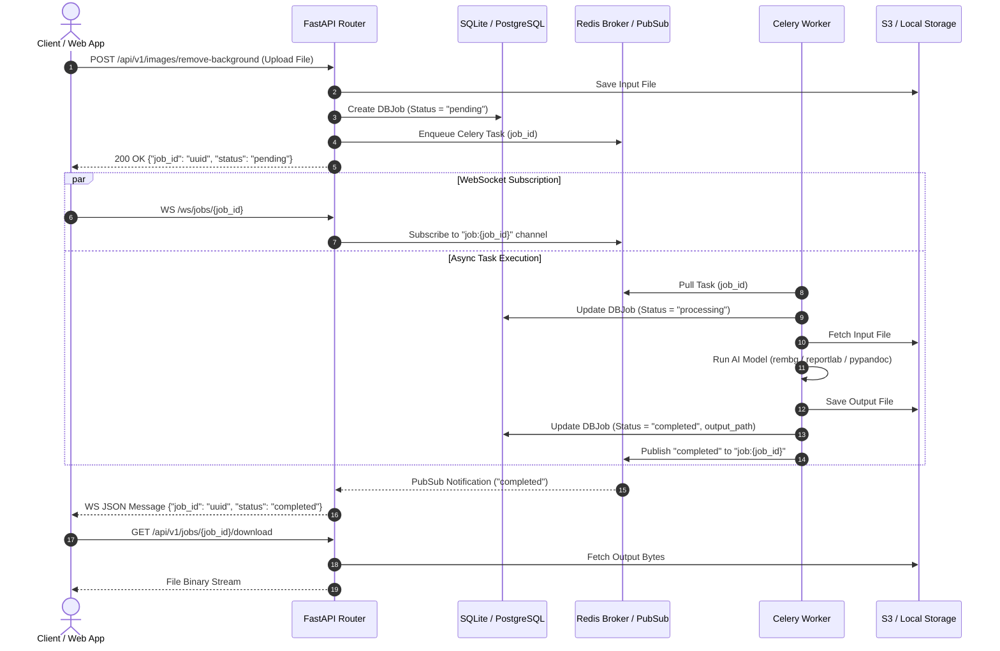
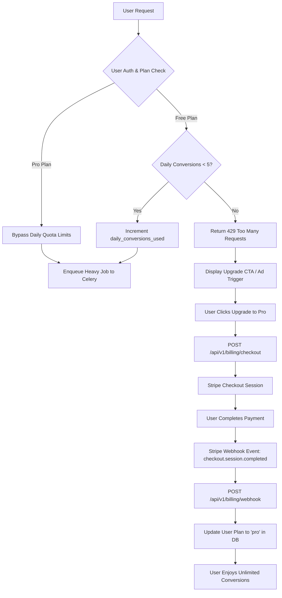

# Phase 4: Celery Task Queue, AI, Storage & Billing Workflows

## 1. Overview
Phase 4 implements the asynchronous task execution architecture, AI models, cloud and local storage abstraction, real-time WebSocket job notifications, and the architectural process mapping for billing integration.

---

## 2. Process Architecture Diagrams

### 2.1 Asynchronous Processing & WebSocket Notification Sequence

---

### 2.2 Billing & Subscription Process Mapping

---

## 3. Core Technical Components

### 3.1 Background Worker (`app/tasks/worker.py`)
- **`task_remove_background(job_id)`**: Executes AI background removal (`rembg`) on images with automatic error catching.
- **`task_convert_document(job_id, target_format)`**: Converts Markdown and DOCX documents to PDF using `pypandoc` and cross-platform `reportlab`.

### 3.2 Unified Storage Service (`app/services/storage.py`)
- Supports local disk storage (`./local_storage/`) with seamless fallback if AWS S3 credentials are not set.

### 3.3 Job Polling & Real-time WebSockets (`app/routers/jobs.py` & `app/routers/websocket.py`)
- `GET /api/v1/jobs/{job_id}`: Poll job status, execution error (if any), and timestamp metadata.
- `GET /api/v1/jobs/{job_id}/download`: Secure file streaming with appropriate Content-Type headers.
- `/ws/jobs/{job_id}`: Low-latency Redis PubSub WebSocket stream with automatic SQLite/Postgres DB polling fallback when Redis is offline.

---

## 4. Verification & Tests (`app/tests/test_phase4.py`)
- `test_background_removal_flow`: End-to-end test for file upload, task execution, status update, and output download.
- `test_document_conversion_flow`: End-to-end document conversion flow.
- `test_job_websocket_flow`: Tests WebSocket real-time status push and fallback loop.
