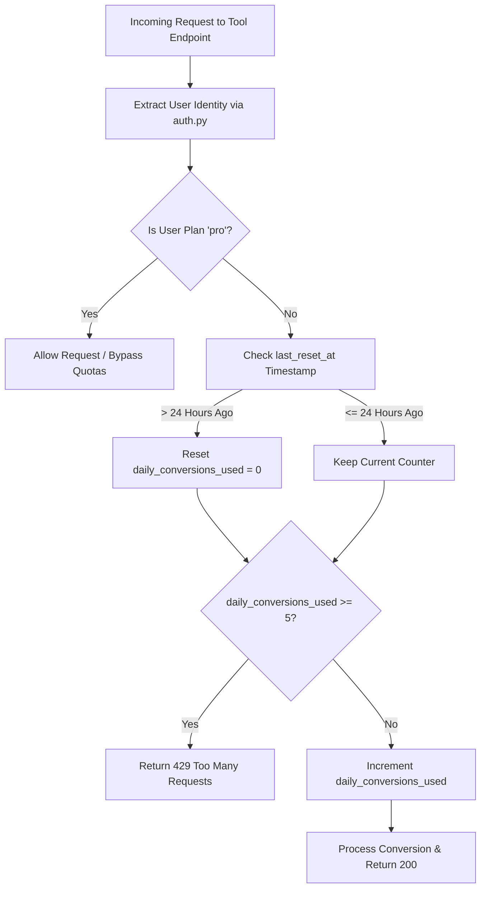
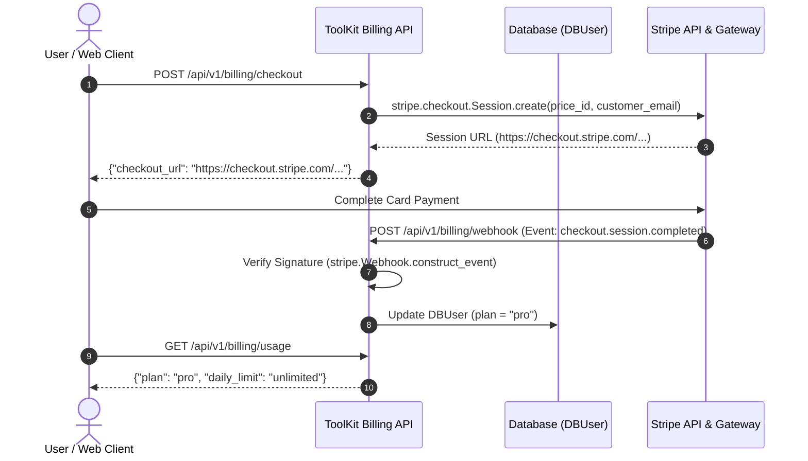

# Phase 5: Rate Limiting, Freemium Tier & Stripe Integration

## 1. Overview
Phase 5 implements platform monetization, freemium rate limiting, daily quota resets, ad trigger metrics, and Stripe subscription lifecycle management (checkout sessions and secure webhooks).

---

## 2. Process Architecture & Data Flow

### 2.1 Quota Enforcement & Daily Reset Lifecycle

### 2.2 Stripe Checkout & Webhook Subscription Upgrade Flow

---

## 3. Key Components to Implement

### 3.1 Rate Limiting Dependency (`app/core/middleware.py`)
- `check_daily_quota(user: DBUser, db: Session)`: Validates free tier usage against `FREE_DAILY_CONVERSION_LIMIT = 5` and handles automatic 24-hour reset timestamps.

### 3.2 Stripe Billing Router (`app/routers/billing.py`)
- `GET /api/v1/billing/usage`: Exposes user quota usage and plan details for frontend display and ad triggers.
- `POST /api/v1/billing/checkout`: Generates Stripe Checkout sessions for plan upgrades.
- `POST /api/v1/billing/webhook`: Handles `checkout.session.completed` and `customer.subscription.deleted` events.

### 3.3 Test Suite (`app/tests/test_phase5.py`)
- Automated tests verifying rate limit HTTP 429 responses, daily resets, usage statistics, and webhook plan transitions.
