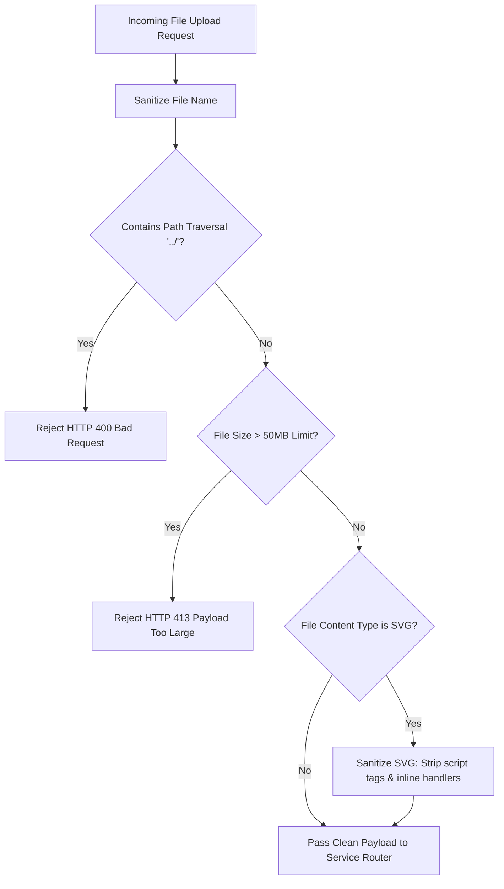

# Phase 6: Email Service, Security Rules & Input Hardening

## 1. Overview
Phase 6 focuses on security hardening, payload sanitization, path injection prevention, and transactional email notification delivery for completed asynchronous jobs.

---

## 2. Technical Architecture & Security Flow

### 2.1 Security & Sanitization Pipeline

---

## 3. Core Components to Build

### 3.1 Security Hardening Utilities (`app/core/security.py`)
- `validate_safe_filename(filename: str)`: Prevents path traversal vulnerabilities (`../`, `..\\`).
- `sanitize_svg_content(svg_bytes: bytes)`: Strips executable JavaScript, `<script>` tags, and `onload=` handlers from SVG files.
- `validate_file_size(file_bytes: bytes, max_mb: int = 50)`: Enforces payload limits.

### 3.2 Transactional Email Client (`app/services/mail.py`)
- Sends automated job completion emails with download links via Resend / SMTP fallback.

### 3.3 Test Suite (`app/tests/test_phase6.py`)
- Integration tests asserting path injection blocks, SVG script stripping, file payload limits, and email dispatch mocks.
