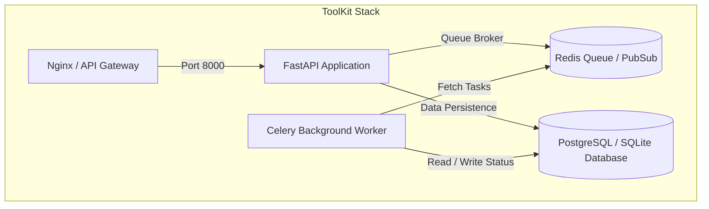

# Phase 7: Orchestration, Testing & Production Launch

## 1. Overview
Phase 7 establishes containerized orchestration, automated database schema migration versioning (Alembic), and end-to-end integration tests mimicking live client scenarios.

---

## 2. Infrastructure Architecture (Docker Compose)

---

## 3. Core Components to Implement

### 3.1 Docker Compose Orchestration (`docker-compose.yml`)
- Orchestrates multi-container communication between:
  - `web` (FastAPI app running on Uvicorn).
  - `worker` (Celery background process executing image/document jobs).
  - `redis` (Message broker & pub/sub notification channel).
  - `db` (Database service).

### 3.2 Database Migration Scaffolding (`alembic`)
- Sets up Alembic configuration to support database schema version tracking and updates.

### 3.3 End-to-End Test Runner (`app/tests/test_phase7.py`)
- Simulates guest workflows, free-tier limitations (rate limit hits), subscription checkout transitions, and real-time WebSocket status updates in a single E2E integration test.
